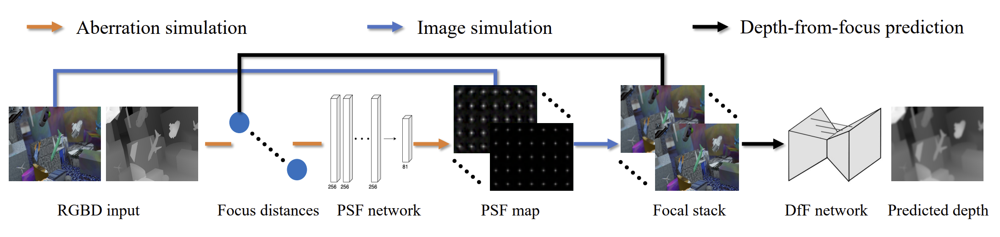
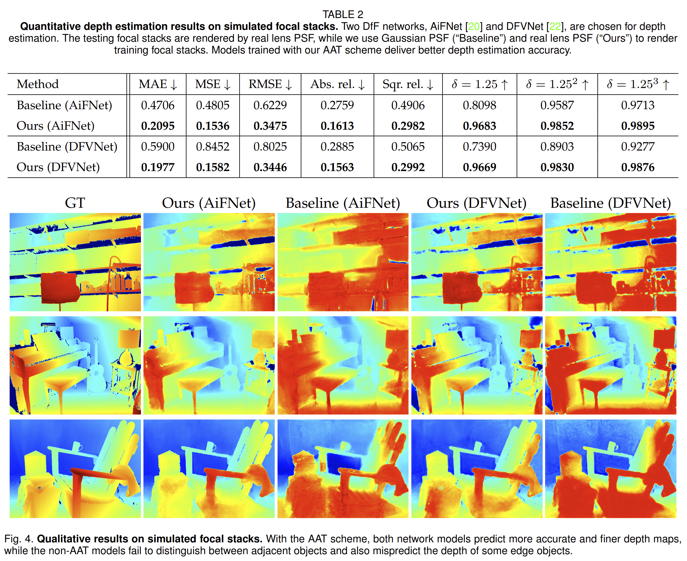
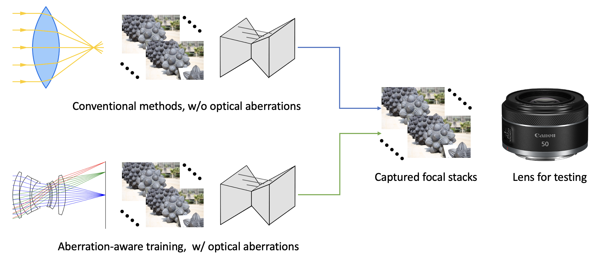
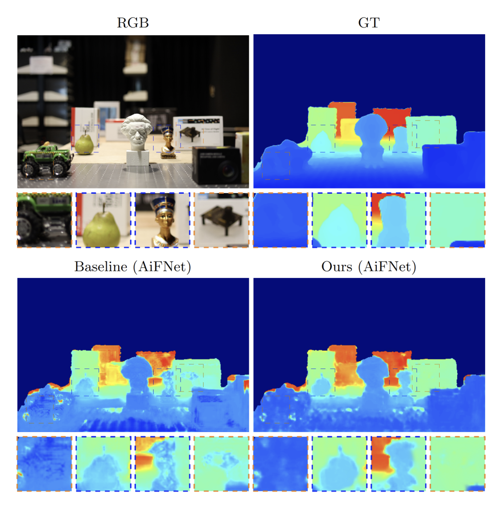

# Aberration-Aware-Depth-from-Focus

Official code for the paper "Aberration-Aware Depth-from-Focus" ([ICCP 2023](https://iccp2023.iccp-conference.org/conference-program/), [TPAMI 2023](https://ieeexplore.ieee.org/abstract/document/10209238))

**TL;DR:** Train a network to represent a lens (4D PSFs). Use the network to simulate aberrated focal stacks. Train depth-from-focus models with aberrated focal stacks. Models can generalize better in real world because it learns from aberrations!

[Xinge Yang](https://singer-yang.github.io/), [Qiang Fu](https://fuqiangx.github.io/), [Mohamed Elhoseiny](https://www.mohamed-elhoseiny.com/),  [Wolfgang Heidrich](https://vccimaging.org/People/heidriw/)
King Abdullah University of Science and Technology, Saudi Arabia



<!-- ### Updates

[**2024.10.02**]  -->

## How to use the code?

This work is a sub-project of our [DeepLens](https://github.com/singer-yang/DeepLens) project. Here we provide the simplified version for re-implementation.

##### Warm up

```bash
#### aberrated-defocued image simulation ####
python 0_warm_up.py
```

##### Train a PSF net for a lens

```bash
#### input: (x, y, z, foc_dist), output: PSF at (x, y, z) when the lens is focused to foc_dist ####
python 1_fit_psfnet.py
```

##### Simulate aberrated focal stack for depth-from-focus model training

```bash
#### simulate focal stack with the same aberration and defocus as capture ####
#### Use AiFNet
python 0_aber_aware_dff_aif.py

#### Use DFVNet
python 0_aber_aware_dff_dfv.py
```

## Results

##### Evaluation on simulated data

Depth map predicted by aberration-aware trained model is more accurate.



##### Evaluation on real-world data

Depth map predicted by aberration-aware trained model is smoother, with fewer artifacts.






## Citations

If our code helps your research or work, please consider citing our paper. The following are BibTeX references:

```
@ARTICLE{10209238,
  author={Yang, Xinge and Fu, Qiang and Elhoseiny, Mohamed and Heidrich, Wolfgang},
  journal={IEEE Transactions on Pattern Analysis and Machine Intelligence}, 
  title={Aberration-Aware Depth-From-Focus}, 
  year={2023},
  volume={},
  number={},
  pages={1-11},
  keywords={Lenses;Optical imaging;Training;Estimation;Computational modeling;Optical sensors;Integrated optics;Depth from focus;optical aberration;point spread function;ray tracing},
  doi={10.1109/TPAMI.2023.3301931}}
```
